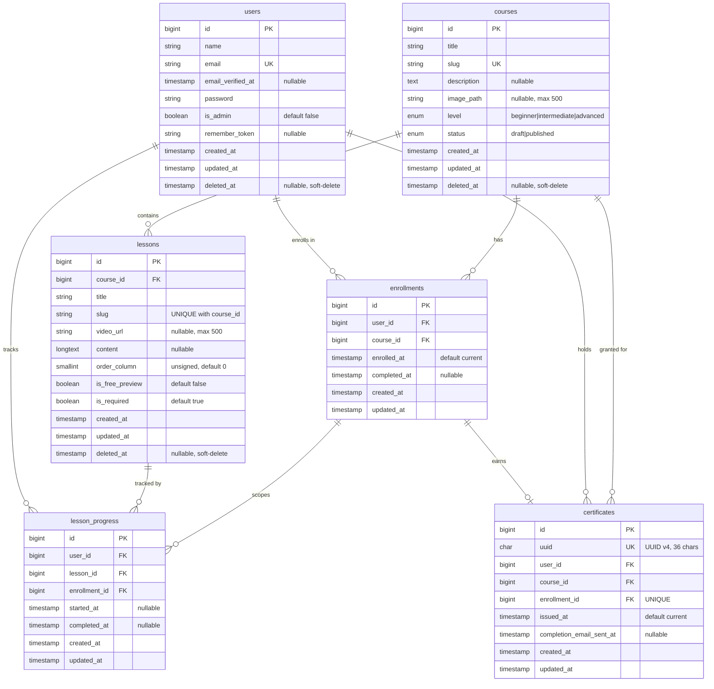

# Entity Relationship Diagram

## Mermaid Diagram



## Table Schemas

### `users`
| Column | Type | Constraints | Notes |
|---|---|---|---|
| `id` | bigint | PK, auto-increment | |
| `name` | varchar(255) | NOT NULL | |
| `email` | varchar(255) | NOT NULL, UNIQUE | Used for login |
| `email_verified_at` | timestamp | nullable | Breeze email verification |
| `password` | varchar(255) | NOT NULL | Bcrypt hash |
| `is_admin` | boolean | NOT NULL, default `false` | Grants Filament panel access |
| `remember_token` | varchar(100) | nullable | |
| `created_at` / `updated_at` | timestamp | | |
| `deleted_at` | timestamp | nullable | Soft-delete |

### `courses`
| Column | Type | Constraints | Notes |
|---|---|---|---|
| `id` | bigint | PK, auto-increment | |
| `title` | varchar(255) | NOT NULL | |
| `slug` | varchar(255) | NOT NULL, UNIQUE | Used in URLs |
| `description` | text | nullable | |
| `image_path` | varchar(500) | nullable | S3 / local disk path |
| `level` | enum | NOT NULL, default `beginner` | `beginner`, `intermediate`, `advanced` |
| `status` | enum | NOT NULL, default `draft` | `draft`, `published` |
| `created_at` / `updated_at` | timestamp | | |
| `deleted_at` | timestamp | nullable | Soft-delete |

### `lessons`
| Column | Type | Constraints | Notes |
|---|---|---|---|
| `id` | bigint | PK, auto-increment | |
| `course_id` | bigint | FK → `courses.id`, CASCADE DELETE | |
| `title` | varchar(255) | NOT NULL | |
| `slug` | varchar(255) | NOT NULL, UNIQUE(`course_id`, `slug`) | Scoped per course |
| `video_url` | varchar(500) | nullable | Plyr.js video source |
| `content` | longtext | nullable | Rich-text body |
| `order_column` | smallint unsigned | NOT NULL, default `0` | Drag-and-drop sort order |
| `is_free_preview` | boolean | NOT NULL, default `false` | Guest-accessible lesson |
| `is_required` | boolean | NOT NULL, default `true` | Counts toward completion |
| `created_at` / `updated_at` | timestamp | | |
| `deleted_at` | timestamp | nullable | Soft-delete |

**Indexes:** `(course_id, order_column)`, `(deleted_at)`

### `enrollments`
| Column | Type | Constraints | Notes |
|---|---|---|---|
| `id` | bigint | PK, auto-increment | |
| `user_id` | bigint | FK → `users.id`, CASCADE DELETE | |
| `course_id` | bigint | FK → `courses.id`, CASCADE DELETE | |
| `enrolled_at` | timestamp | NOT NULL, default current | |
| `completed_at` | timestamp | nullable | Set atomically; `NULL` = in progress |
| `created_at` / `updated_at` | timestamp | | |

**Unique:** `(user_id, course_id)` — one enrollment per user per course

### `lesson_progress`
| Column | Type | Constraints | Notes |
|---|---|---|---|
| `id` | bigint | PK, auto-increment | |
| `user_id` | bigint | FK → `users.id`, CASCADE DELETE | |
| `lesson_id` | bigint | FK → `lessons.id`, CASCADE DELETE | |
| `enrollment_id` | bigint | FK → `enrollments.id`, CASCADE DELETE | Links progress to an enrollment |
| `started_at` | timestamp | nullable | Set on first play |
| `completed_at` | timestamp | nullable | Set on explicit "Mark complete" |
| `created_at` / `updated_at` | timestamp | | |

**Unique:** `(user_id, lesson_id)` — one progress row per user per lesson
**Indexes:** `(enrollment_id)`, `(user_id, completed_at)`

### `certificates`
| Column | Type | Constraints | Notes |
|---|---|---|---|
| `id` | bigint | PK, auto-increment | |
| `uuid` | char(36) | NOT NULL, UNIQUE | UUID v4 — used in public URL |
| `user_id` | bigint | FK → `users.id`, CASCADE DELETE | |
| `course_id` | bigint | FK → `courses.id`, CASCADE DELETE | Denormalized for easy lookup |
| `enrollment_id` | bigint | FK → `enrollments.id`, CASCADE DELETE, UNIQUE | One cert per enrollment |
| `issued_at` | timestamp | NOT NULL, default current | |
| `completion_email_sent_at` | timestamp | nullable | Guards exactly-once email send |
| `created_at` / `updated_at` | timestamp | | |

## Relationships

| From | Cardinality | To | Constraint |
|---|---|---|---|
| `users` | 1 → N | `enrollments` | `enrollments.user_id` FK |
| `courses` | 1 → N | `enrollments` | `enrollments.course_id` FK |
| `users` + `courses` | — | `enrollments` | UNIQUE(`user_id`, `course_id`) |
| `courses` | 1 → N | `lessons` | `lessons.course_id` FK |
| `users` | 1 → N | `lesson_progress` | `lesson_progress.user_id` FK |
| `lessons` | 1 → N | `lesson_progress` | `lesson_progress.lesson_id` FK |
| `enrollments` | 1 → N | `lesson_progress` | `lesson_progress.enrollment_id` FK |
| `enrollments` | 1 → 0..1 | `certificates` | UNIQUE(`enrollment_id`) |
| `users` | 1 → N | `certificates` | `certificates.user_id` FK |
| `courses` | 1 → N | `certificates` | `certificates.course_id` FK |

## Key Design Decisions

### `lessons.is_required`
Determines whether a lesson counts toward course completion. The completion strategy (`AllRequiredLessonsCompletionStrategy`) queries only `is_required = true AND deleted_at IS NULL` lessons. When an admin deletes a required lesson or toggles `is_required`, the `LessonObserver` automatically re-checks all active enrollments for that course and marks them complete if the condition is now met.

### `lessons.is_free_preview`
Allows unauthenticated guests to view the lesson. `LessonPolicy::view(?User $user, Lesson $lesson)` accepts a nullable user and returns `true` when this flag is set.

### `enrollments.completed_at`
Written atomically:
```sql
UPDATE enrollments SET completed_at = NOW()
WHERE id = ? AND completed_at IS NULL
```
The `affected > 0` check ensures `CourseCompleted` fires exactly once, even if a queue worker retries the job.

### `certificates.completion_email_sent_at`
Same atomic-write pattern as `enrollments.completed_at`. `CertificateRepository::markEmailSent()` uses `whereNull('completion_email_sent_at')` so the welcome email is guaranteed to send exactly once.

### `certificates.uuid`
UUID v4, generated via `Str::uuid()`. Exposed in the public verification URL (`/certificates/{uuid}`) so employers can verify certificates without exposing internal IDs.

### `users.is_admin`
Simple boolean flag. Checked in `User::canAccessPanel()` (Filament gate) and `Policy::before()` (grants admins full bypass on all resource policies).
